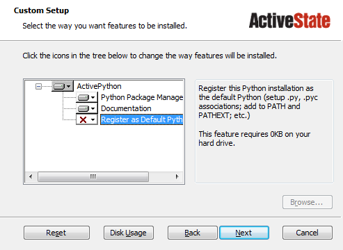

.. _getting_started_running:

Getting Started Running Scripts
===============================

Overview of Steps
-----------------

To get MontyLacuna working, you'll have to follow a few steps.  These are 
similar to the steps necessary to setting up the standard Lacuna scripts 
written in Perl.

- Install Python 3

  - :ref:`inst_python_windows`
  - :ref:`inst_python_nonwindows`
- :ref:`inst_monty`
- :ref:`inst_pip`
- :ref:`create_config_file`
- :ref:`run_test_script`
- :ref:`update_with_git`

.. _inst_python:

Install Python 3
----------------

.. _inst_python_windows:

Windows
~~~~~~~
You can download Python 3 from `ActiveState's website.  
<http://www.activestate.com/activepython/downloads>`_  Make sure you download 
version **3.whatever**, *not* version **2.whatever**.  

During installation, the installer will show you what features will be 
installed.  In some cases, *Register as Default Python* will be unselected, as 
indicated by the red X in the picture:

    |as_python_default|

We want that turned on.  Click on the little down arrow just to the right of 
the red X, and set this feature to be installed.  When you're done, the window 
should look like this:

    |as_python_fixed|

From here on, just click the Next button until the installer completes.

After the installer is complete, open up a new ``CMD`` window (if you already 
had one open, close it and open a new one) and type::

    python --version

That should respond with something like this::

    Python 3.4.1.0

If that's what you see, then Python has been installed successfully.  If 
that's not what you see, then see the :ref:`troubleshoot_python_install` docs.

.. _inst_python_nonwindows:

Non-Windows
~~~~~~~~~~~

If you're on Linux or Mac, you should already have Python installed.  But make 
sure that you've got Python 3.  Many systems come with Python 2, not 3, and 
MontyLacuna will not work with Python 2.  Python 3 should be available via 
your package manager.

.. _inst_monty:

Install MontyLacuna
-------------------
Download your preferred filetype.  For most people, that will be the "zip" 
file.

    ====  ===============
    Type  Link
    ====  ===============
    Zip   `Download zip file <https://github.com/tmtowtdi/MontyLacuna/zipball/master>`_
    Tar   `Download tar file <https://github.com/tmtowtdi/MontyLacuna/tarball/master>`_
    ====  ===============

- Open the ``zip`` file using whatever unzip tool you like.  It contains just 
  one folder, named something like ``tmtowtdi-MontyLacuna-1234abc``.  Drag 
  that out to ``My Documents`` on your computer.

  - On Windows, you don't need to go download an unzip tool.  Double-click on 
    the .zip file after you've downloaded it, and Windows will open it up like 
    it's a regular folder.

- After dragging that oddly-named folder into ``My Documents``, rename it to 
  simply ``MontyLacuna``.

.. _inst_pip:

Install pip and Prerequisite Libraries
--------------------------------------
pip is a tool for installing Python libraries.  Installing pip is very easy, 
as MontyLacuna includes a script to install it for you.

Open up a terminal window (on Windows, this means ``CMD.exe``).  Change into 
the root MontyLacuna folder -  the one you just extracted in the previous step 
- and run the pip installer script::

    >>> python bin/get-pip.py

``pip`` is now installed.

There are only two Python libraries to install, ``requests`` and ``beaker``, 
and you install both of them using ``pip`` by typing these two commands one at 
a time::

    >>> pip install requests
    >>> pip install beaker

If either of those ``pip`` commands produced errors, see the 
:ref:`troubleshoot_pip_install` docs.

After pip and the prerequisite libraries are installed, leave that CMD window 
open for the next step.

.. _create_config_file:

Create A Config File
--------------------
For this next step, you'll need to know your Lacuna password.  And if you have 
a sitter password setup, you should know that too.  Make sure you have those 
in front of you before trying to create your config file.

Using the CMD window you left open from the previous step, run the config file 
creation script::

    python bin/create_config_file.py

That will ask you several questions, and then create your config file for you.

.. _run_test_script:

Ready to Test
-------------
At this point, you should be set to run any of the available scripts in the 
``bin/`` directory.  There's a test script that will show you a few details 
about your empire, and requires no arguments.  Try it out by typing::

    python bin/test_script.py

If that tells you "Congratulations", you're all set.  Now you can move on to 
running whatever :ref:`scripts_index` you want.

.. _update_with_git:

Completely Optional -- Update with Git
--------------------------------------
If any part of this section is confusing to you, it's perfectly OK to skip.  
Following this section will make updating MontyLacuna easier, but it is 
*optional*.

If you follow the directions above, any time you want to update MontyLacuna to 
get the most recent scripts, you'll need to re-download the whole thing and 
then replace your existing MontyLacuna folder with the new one, and remember 
to copy over your old config file.  You could just re-create a new config file 
with the config file creation script, but if you made any custom modifications 
to your old config file, those would be lost.

``git`` is a program used to keep track of software projects like MontyLacuna.  
If you install git, you can instead use that to update without losing your 
existing setup.

The steps for going this route:

    - `Download git for Windows <http://git-scm.com/download/win>`_ and install it.
      Obviously if you're on a platform other than Windows, please don't 
      follow that link.  Find the git distribution for whatever OS you're on.
    - Open up a ``CMD`` window into your My Documents directory, and enter the 
      following command::
        >>> git clone git@github.com:tmtowtdi/MontyLacuna.git
      That will fully download the current version of MontyLacuna into a 
      folder named ``MontyLacuna``, under the My Documents folder that you're 
      in right now.
    - Now, any time you want to update your MontyLacuna installation to get 
      any updates or changes, you'll open a ``CMD`` window into that 
      MontyLacuna folder (not My Documents this time, all the way into 
      MontyLacuna), and enter this command::
        >>> git pull origin master
    - That's it.  Any changes, new scripts, etc made to the main MontyLacuna 
      project will be downloaded to your machine.

